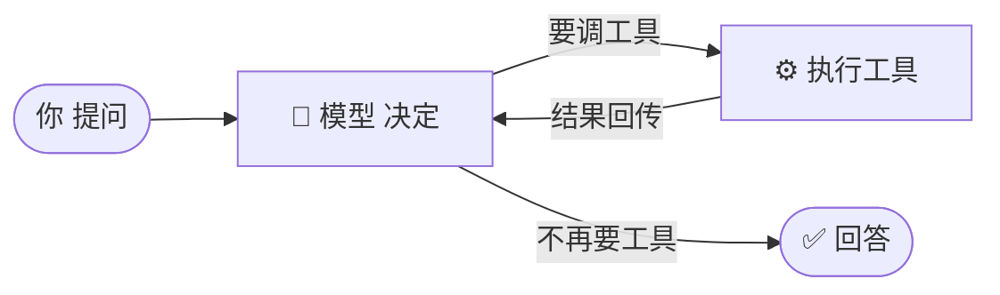
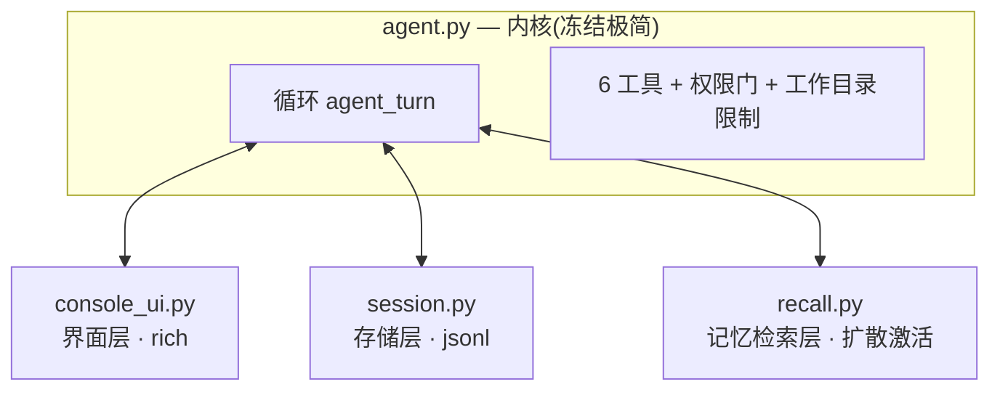
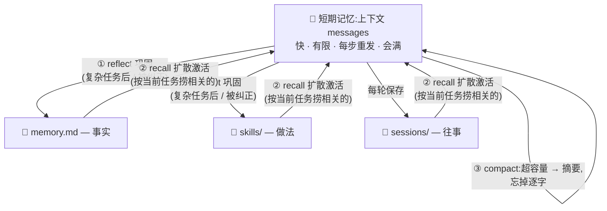

# Talos 能力总览 🛡️

一个**最小、可自扩展、会自学习**的编程 agent —— Pi 的极简内核 + Hermes 的成长性 + Claude Code 的使用体验,从零手搓、边搭边学的产物。

> 一句话:**模型负责想,代码负责做,循环把它们串起来;记忆让它越用越懂你。**

---

## 1. 核心循环

一切的中心。模型本身没记忆、碰不到你的电脑 —— 是这个循环让它能连续动手做事。



代码就是 `agent_turn()` 里的 `while` 循环,`tool_calls` 有没有 = 要不要再转一圈。

---

## 2. 能力清单

| 类别 | 能力 |
|------|------|
| **内核** | 极简循环 + `messages` 记忆;6 个工具:`read_file` / `write_file` / `edit_file` / `run_bash` / `create_tool` / `spawn_subagent` |
| **多模型** | 走 OpenAI 兼容接口,一套代码通吃 **Claude / GPT / Gemini / DeepSeek / GLM / Kimi**;`TALOS_PROVIDER` + `TALOS_MODEL` 切换;`.env` 一次配置;繁忙/限流自动重试 |
| **安全** | Claude-Code 式**权限分级**(plan / default / acceptEdits / bypass);**工作目录限制**(文件工具出不去);**MAX_STEPS** 防空转 |
| **自扩展(深度)** | `create_tool` —— 没有合适工具时,**自己写一个新工具、当场加载、下次还在**(Pi 式) |
| **委派(广度)** | `spawn_subagent` —— 把子任务丢给隔离上下文的子 agent,只回摘要 |
| **自学习** | `reflect` —— 复杂任务后 / **被纠正时**,把经验写成 `skills` / `memory.md`;`/consolidate` 合并去重 |
| **记忆系统** | 短期(上下文+压缩)· 长期(事实/技能/往事)· **联想回忆**(扩散激活)· **用不到就忘** |
| **会话** | 本地 `.jsonl` 存储,**按首句自动起名**;续聊 / 查看 / 删除;上下文超限**自动压缩** |
| **省 token** | 工具输出截断 + 分页读文件 + 旧结果打桩 + 白吃 provider 缓存 |
| **界面** | `rich` 终端 UI;`/show` 四档显示模式(quiet/normal/verbose/transcript)+ 思考过程 |

---

## 3. 架构:分层(内核冻结,外围可换)



**每层可单独替换,内核不动**(Pi 的思路):界面换成网页只改 `console_ui.py`;存储换 SQLite 只改 `session.py`;检索换 embedding 只改 `recall.py`。

---

## 4. 记忆系统架构(像大脑一样分层)



**④ 优胜劣汰**:`/consolidate` 合并去重、`/forget` 删掉"见过多次却从没被 recall 想起"的死记忆 —— **让使用来决定去留**。

和人脑的对应:

| 人类记忆 | Talos |
|---|---|
| 工作/短期 | 上下文 `messages` + 压缩 |
| 长期·语义(事实) | `memory.md` |
| 长期·程序(做法) | `skills/` |
| 长期·情景(往事) | `.talos/sessions/` |
| 联想回忆 | `recall.py`(扩散激活) |
| 睡眠巩固 / 遗忘 | `reflect` / `consolidate` / `forget` |

---

## 5. 命令参考(程序内输入)

| 命令 | 作用 |
|------|------|
| `/mode <档>` | 切权限档:plan · default · acceptEdits · bypass |
| `/show <档>` | 切显示:quiet · normal · verbose · transcript |
| `/reflect` | 立即复盘(存 skill/memory) |
| `/consolidate` | 合并、精简技能 |
| `/recall <词>` | 看联想回忆的激活分数(调试) |
| `/forget` | 删掉从没被想起的死记忆 |
| `/history` | 列出历史会话 |
| `/view <#/id>` | 看某个会话内容 |
| `/resume <#/id>` | 调出历史会话继续 |
| `/delete <#/id>` | 删除会话 |
| `/compact` | 手动压缩上下文 |
| `/goal <条件>` | 设完成条件。模型不调工具时不直接结束,先过一个**独立判断器**(单独一次调用,只有 `read_file`,会自己打开交付物核对);没达成就把理由写回对话继续做。`/goal` 查看,`/goal clear` 清除。无人值守用环境变量 `TALOS_GOAL` |
| `quit` | 退出 |

命令行参数:`--continue` / `--resume <id>` / `--list` / `--view <id>` / `--delete <id>` / `--selfcheck` / `--model <provider>/<模型>`。

---

## 6. 文件地图

```
talos/
├── agent.py          内核:循环 + 工具 + 权限 + 自学习/自扩展
├── console_ui.py     界面层(rich TUI)
├── session.py        存储层(会话 jsonl)
├── recall.py         记忆检索层(扩散激活 + 用量遗忘)
├── requirements.txt  openai, rich
├── .env              provider + key(不进 git)
├── README / DEVELOPMENT / SELF_LEARNING / OVERVIEW(本文)
└── 运行时(gitignore):
    ├── memory.md          学到的事实
    ├── skills/*.md        学到的做法
    ├── tools/*.py         自己造的工具
    └── .talos/
        ├── sessions/*.jsonl   会话历史
        └── recall_hits.json   记忆使用统计
```

---

## 7. 怎么跑

```bash
pip install -r requirements.txt
# .env 里写 TALOS_PROVIDER=glm 和 ZHIPUAI_API_KEY=...
python agent.py
python agent.py --selfcheck    # 零依赖离线自检
```

---

## 8. 已知取舍 / 路线图

- **沙箱(Step 3)暂缓**:权限门 + 工作目录限制挡住大部分误操作,但 `run_bash` 允许后仍在宿主机跑。彻底隔离要 WSL2/Docker,用得上再加。
- **`create_tool` 在本进程 exec 模型代码**:很强也很猛,靠权限门把关,同样等沙箱兜底。
- **记忆检索是关键词网**:够学、够用;要更准可换 embedding(只改 `recall.py`)。
- **单文件内核**:刻意的,塞不下了再拆。

> Talos 不是要跟 Cursor/Claude Code 拼功能 —— 它是一台**能看懂全部代码、每个零件都是你亲手加的**学习机器。agent 的所有核心概念(循环、工具、权限、记忆、自学习、自扩展、上下文管理),它都有一个能读懂的最小实现。
