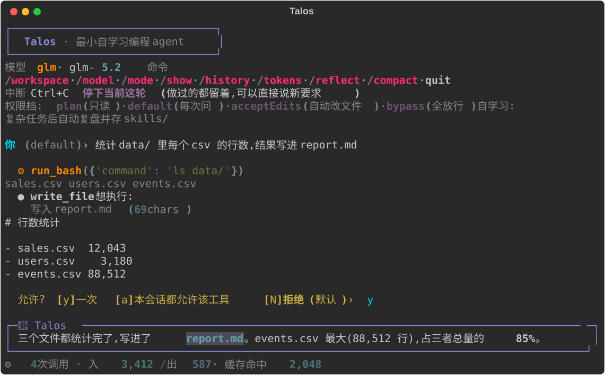

# Talos 🛡️

[](https://github.com/Jerry-TZ/Talos/actions/workflows/test.yml)

**一个你能完整读完的编程 agent。** 3962 行 Python,215 条离线判据,一份不糊弄人的安全说明。



> 上图由 `console_ui.py` 真实渲染导出 —— 不是画的示意图。

> 希腊神话里,**Talos** 是守卫克里特岛的青铜自动人偶 —— 一个会保护人的 automaton。

```
你 → 模型(说) → 工具(做) → 结果回传 → … → 回答
        └──────── 循环,直到模型不再要工具 ────────┘
```

这个循环就是 agent 的全部。Talos 把它连同权限、记忆、自扩展一起,压进四个文件:

| 文件 | 行数 | 职责 |
|---|---|---|
| `agent.py` | 2971 | 循环 + 工具 + 权限门 + 自学习 |
| `console_ui.py` | 214 | 终端界面(可整体替换) |
| `recall.py` | 506 | 联想记忆:扩散激活检索 |
| `session.py` | 271 | 会话持久化(想换 SQLite 只改这个) |

行数自己数,别信我:`wc -l agent.py console_ui.py recall.py session.py`

---

## 为什么是这个,而不是另外五十个 agent

极简 agent 赛道很挤,有人用 Zig 做到 678KB 二进制。**Talos 不比谁小,它比谁都好读。**

- **能读完** — 四个文件,注释解释的是*为什么*,不是*是什么*。几乎每条防御旁边都写着它挡的那次真实翻车。
- **能验证** — 215 个测试,**离线、免 API key、几秒跑完**,CI 在 Linux/Windows × Python 3.10/3.13 上都跑。clone 下来立刻知道它没坏。
- **不吹牛** — [`SECURITY.md`](SECURITY.md) 明写 `create_tool` 就是进程内 RCE、正则黑名单只是减速带。**没有沙箱就是没有沙箱** —— 真要隔离,[三条现成方案](SECURITY.md#真要隔离怎么办)按代价从低到高列在那儿。
- **有考卷** — [`EXAM.md`](EXAM.md) / [`EXAM2.md`](EXAM2.md) 是两份可复现的能力测试,带标准答案和作弊检测(比如逐个核验 arXiv ID 真伪,防止编造引用)。记录的是"我怎么验证它真的有用",不是功能列表。
- **有实测** — [`FINDINGS.md`](FINDINGS.md) 记了二十二个真实任务量出来的东西:哪条提示词生效、哪条从头到尾没生效、六次翻车、检索改动的前后数字,以及**两个被数据否掉的自己的方案**。样本小,局限写在最前面。

---

## 快速开始

**Windows**:clone 下来双击 `setup.bat`(建 venv、装依赖、跑一遍自检),然后编辑 `.env` 填 key,双击 `talos.bat`。

手动装(Linux/macOS 或想自己控制):

```bash
git clone https://github.com/Jerry-TZ/Talos.git && cd Talos
python -m venv .venv
.venv/bin/pip install -r requirements.txt         # Windows: .venv\Scripts\pip
cp .env.example .env
```

把 key 写进 `.env`(参考 `.env.example`):

```
TALOS_PROVIDER=glm
ZHIPUAI_API_KEY=你的key
TALOS_MODEL=glm-4.6
```

启动 —— Windows 直接双击 `talos.bat`,或者:

```bash
.venv\Scripts\python.exe agent.py
```

不用 key 也能验证它没坏:

```bash
python agent.py --selfcheck
```

试试:`列出当前目录文件,然后新建 hello.txt 写一句话` —— 动盘之前你会看到 `● write_file 想执行:` 的确认框。

**支持的 provider**:`claude` · `openai` · `gemini` · `deepseek` · `glm` · `kimi`。全走 OpenAI 兼容接口,加一个只要在 `PROVIDERS` 里加一行 —— 换模型是配置,不是改代码。

| `TALOS_PROVIDER` | key 环境变量 | 默认模型(`TALOS_MODEL` 可覆盖) |
|---|---|---|
| `claude`(默认) | `ANTHROPIC_API_KEY` | claude-haiku-4-5 |
| `openai` | `OPENAI_API_KEY` | gpt-4o-mini |
| `gemini` | `GEMINI_API_KEY` | gemini-2.0-flash |
| `deepseek` | `DEEPSEEK_API_KEY` | deepseek-chat |
| `glm` | `ZHIPUAI_API_KEY` | glm-4.7-flash |
| `kimi` | `MOONSHOT_API_KEY` | moonshot-v1-8k |

---

## 它能做什么

**六个工具** — `read_file` / `write_file` / `edit_file` / `run_bash`,外加 `create_tool`(给自己造新工具)和 `spawn_subagent`(派子 agent,独立上下文)。

子 agent 的结论后面**跟着一行它实际做过什么** —— 由主循环按真实分发计数,子 agent 无法自己编:

```
[子agent 实际调用 — 主循环记录,非子agent自述] read_file × 3 · run_bash × 1,失败 1
```

所以「我读完了三个文件,没发现问题」配上 `(没有调用任何工具)`,当场就露馅。只记工具名和次数,**不含参数、路径、命令或输出** —— 摘要不会把 key 顺回上层上下文。

**权限分级**(对齐 Claude Code)—— `/mode` 随时切:

| 档位 | 行为 |
|---|---|
| `plan` | 只读,任何写操作直接拒 |
| `default` | 每次改动都问 |
| `acceptEdits` | 自动改文件,跑命令仍要问 |
| `bypass` | 全放行(⚠️ 别对不信任的任务用) |

被拒的原因会回传给模型,它会换思路 —— 你也可以不按 y/n,**直接打字说理由**。

**自扩展** — `create_tool` 让它写一个新工具,当场注册可用,重启自动加载。批准前会**完整显示**要执行的代码,而且不支持「本会话都允许」——每次要跑的代码都不一样。只有批准过的工具会自动加载(按内容哈希核对),来路不明或被改过的文件一律隔离、不执行:

```bash
.venv\Scripts\python.exe agent.py --approve-tools        # 逐个看代码、逐个决定
```

**自学习** — 复杂任务后自动复盘:可复用的做法写进 `skills/`,持久事实写进 `memory.md`。下次遇到相关任务,`recall.py` 用**扩散激活**(节点=记忆,边=共享关键词)把相关技能的正文捞回上下文。

技能正文只在**第一名明显甩开第二名**时才注入 —— 名次是相对的,再不相关的一堆记忆也有个第一名。实测:真命中时冠军甩开亚军 2 倍以上,纯噪声时挤在 1.1 倍以内。以前按名次给正文,问一句跟项目无关的话也会被塞进两条 1200 字的无关技能。

复盘写的行会被**自动打上来源标记**(代码打的,不指望模型自觉):

```markdown
- 项目用 GLM 不用 OpenAI                          ← 你手写的,没有标记
- pandas 要先 pip install  <!-- reflect 2026-07-29 -->
```

每轮检索都留一行轨迹(`.talos/recall_trace.jsonl`),记下捞了哪几条、激活分数、有没有注入正文 —— 提问只存哈希。**它只落盘,不统计**:回答"扩散带进来的第 4、5 名是不是长期噪声"要靠真实数据,不是靠调参的直觉。

```bash
tail -3 .talos/recall_trace.jsonl
```

`/forget` 据此清理:**只提议删 Talos 自己写的**,并且分两类给你理由 —— *「出现 12 次从没被想起」*(存了个寂寞)和*「上次想起是 200 天前」*(过时了)。你手写的事实它无权判断,永远不碰。

**省 token** — 读文件截断分页、旧工具输出打桩、上下文自动压缩、稳定前缀走 provider 缓存。每轮结束显示调用次数 / 输入输出 / 缓存命中,`/tokens` 看累计。

**会话** — 按第一句话自动起名,`/history` 列表、`/resume` 续上、`--continue` 接最近一次。

**一次性模式** — `agent.py -p "任务"` 跑完即退,方便脚本和计时。

**可选自动化**(默认关闭,在 `talos.bat` 里开):

```bat
set "TALOS_AUTOTEST=python -m pytest -q"   REM 每次改 .py 后自动跑,失败信息贴在闯祸的那一步
set "TALOS_AUTOCOMMIT=1"                   REM 测试通过才提交,只 add 改动的那一个文件
```

> 这两个**不是 hook** —— 只有你自己的环境变量能设,装再多技能也注册不进来。Talos 刻意没有插件自动执行机制。

---

## 常用命令

```
/workspace <路径>   切换工作目录         /model <名字>    换模型
/mode <档位>        切权限档             /show <模式>     quiet·normal·verbose·transcript
/history  /resume   会话列表 / 续上       /tokens         用量统计
/reflect            手动复盘             /consolidate    整理技能库
/compact            压缩上下文           /recall <词>    看联想检索的激活分数
Ctrl+C              停下当前这轮 —— 做过的都留着,可以直接说新要求
```

---

## ⚠️ 安全边界

**Talos 在你的机器上直接跑,没有沙箱。** 安全边界 = 权限确认框 + 你的判断。

**已经修的**:工作区隔离(实测 7 种路径穿越全拦)· 确认框弹出前清空输入缓冲(等待时敲的键不会被当成你的回答)· `pip` 锁死在 venv 里 · 出网和**任何删除**永远弹确认(会话放行也不例外,删除还不接受 `a`,只认单独按 `y`)· 未批准的工具不自动执行 · 恶意技能扫描 · **任何写操作前先把工作区存进 `.talos/trash/`**(按内容寻址,永不覆盖 —— 一次真实运行里十五个脚本原地覆盖毁掉了数据,全程没出现过一个 `del`)。

**修不了的**(架构性,不藏着):`create_tool` 的代码 exec 在进程内 —— 批准它等于批准任意代码;出网/删除检测是正则黑名单,能被绕过。

**别在 `bypass` 模式或 `-p` 一次性模式下,跑你没读过的任务、技能或网页内容。** 完整威胁模型见 [`SECURITY.md`](SECURITY.md)。

---

## 开发

```bash
.venv\Scripts\python.exe -m pip install -r requirements-dev.txt
.venv\Scripts\python.exe -m pytest tests/ -q     # 215 条,约 8 秒,不联网、不需要 key
python agent.py --selfcheck                       # 免依赖的冒烟检查
```

更多文档:[`DEVELOPMENT.md`](DEVELOPMENT.md) 实现逻辑 · [`OVERVIEW.md`](OVERVIEW.md) 能力全景 · [`SELF_LEARNING.md`](SELF_LEARNING.md) 自学习怎么做的 · [`FINDINGS.md`](FINDINGS.md) 二十二个真实任务测出来的东西

[`JUDGING.md`](JUDGING.md) 是从 `FINDINGS.md` 里抽出来的方法论,**不提这个项目**:六种「判据本身没人查」的形状、反向验证怎么做、以及它自己会怎么骗你。跟 Talos 无关也能读。

## 由来

站在 [Pi](https://github.com/badlogic/pi-mono)(最小核 + 自扩展)和 Hermes(自学习)的思路上,补一层它们刻意跳过的权限门。

## License

MIT — 见 [`LICENSE`](LICENSE)。
